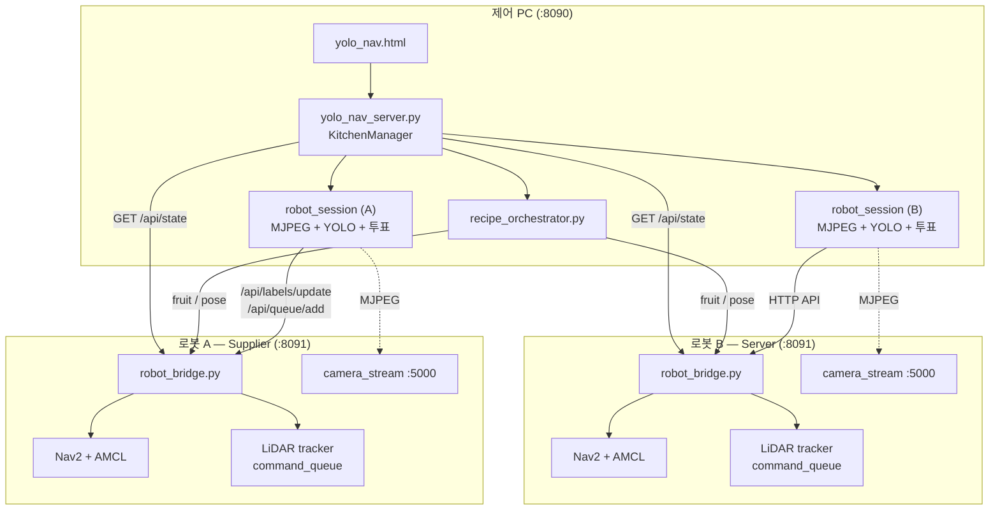
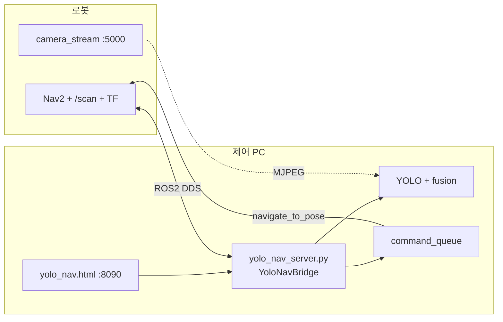
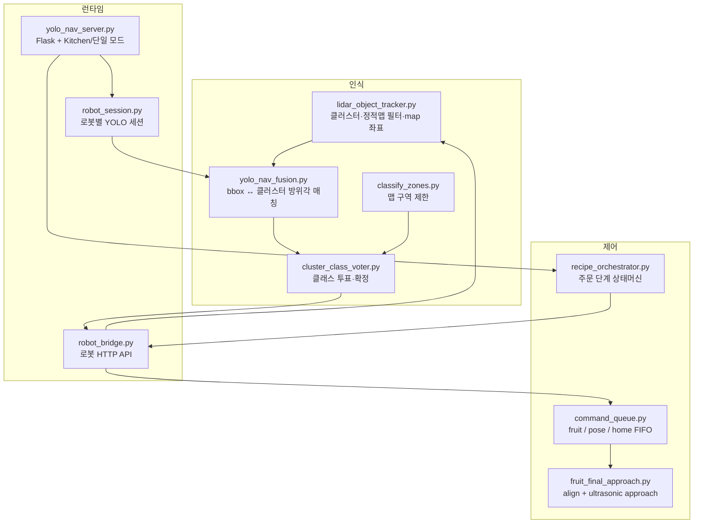
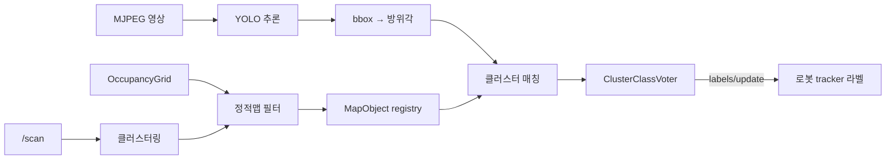
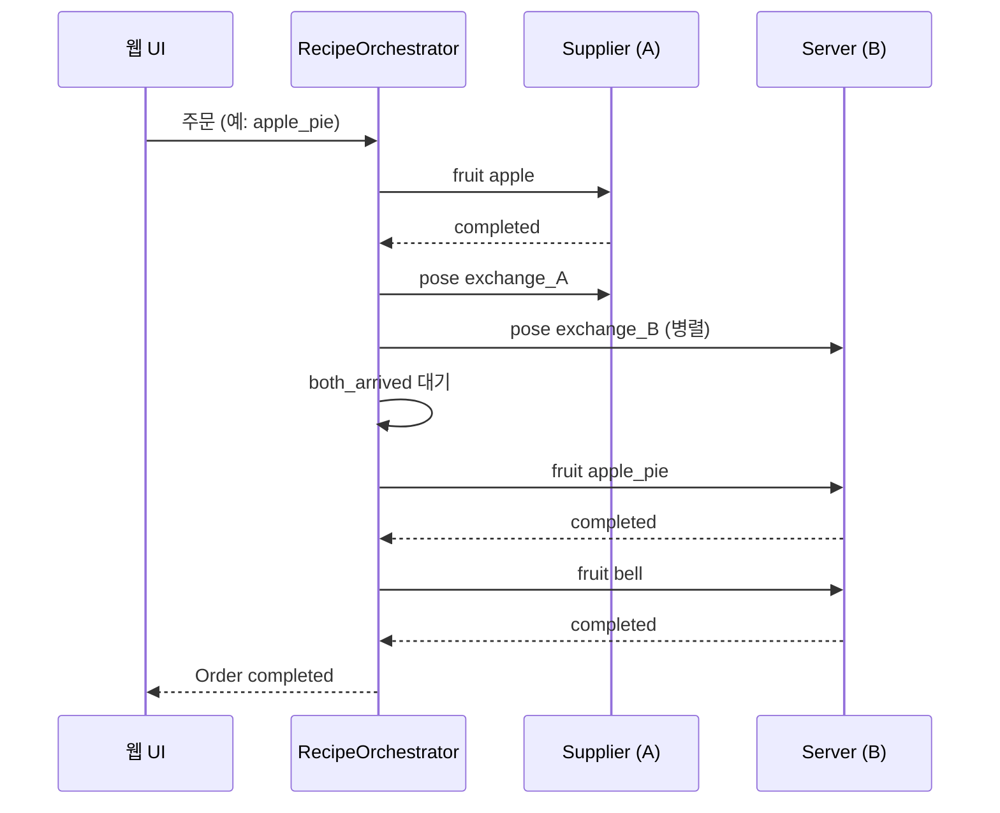
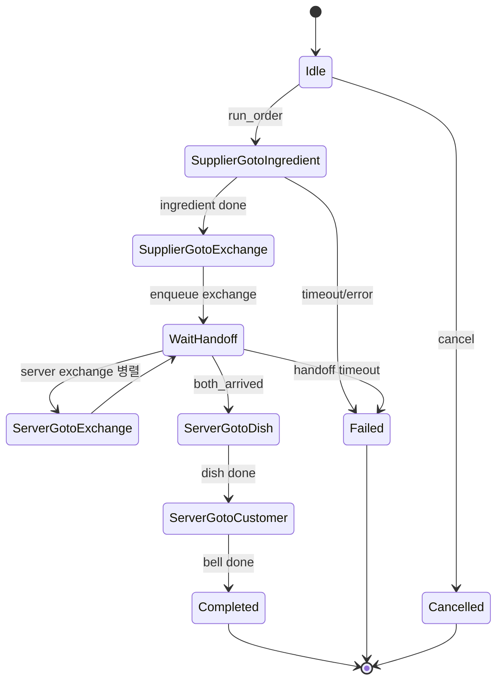

# Pinky Pro — YOLO·LiDAR 융합 내비게이션 & 주방 오케스트레이션

사전 매핑 맵 위에서 **LiDAR 클러스터**로 동적 물체 위치를 추정하고, **YOLO**로 클래스를 라벨링한 뒤, **Nav2**로 접근·교환·서빙을 수행하는 제어 스택입니다.

단일 로봇 과일 내비게이션과, 역할이 나뉜 **2대 로봇 주방 오케스트레이션**을 지원합니다.

코드 위치: [`pinky_pro/`](./pinky_pro/)

---

## 목차

1. [개요](#1-개요)
2. [시스템 아키텍처](#2-시스템-아키텍처)
3. [인식·융합 파이프라인](#3-인식융합-파이프라인)
4. [주문 워크플로](#4-주문-워크플로)
5. [디렉터리 구조](#5-디렉터리-구조)
6. [포트·실행 위치](#6-포트실행-위치)
7. [빠른 시작](#7-빠른-시작)
8. [설정](#8-설정)
9. [관련 문서](#9-관련-문서)

---

## 1. 개요

| 항목 | 내용 |
|------|------|
| 맵 | 사전 매핑 (`mini_prj_map*`) + AMCL 로컬라이제이션 (SLAM 아님) |
| 위치 | LiDAR `/scan` 클러스터 → map 좌표 (`lidar_object_tracker.py`) |
| 클래스 | HTTP MJPEG(320×240) + YOLO (`robot_session` / `yolo_nav_fusion`) |
| 주행 | Nav2 `navigate_to_pose` + fruit 미세 접근(align/approach) |
| UI | Flask `:8090` + `yolo_nav.html` |
| 오케스트레이션 | `recipe_orchestrator.py` (supplier / server) |

### 동작 모드

| 모드 | 실행 | 설명 |
|------|------|------|
| **단일 로봇** | `yolo_nav_server.py` (ROS 직접 연결) | PC가 Nav2·LiDAR·큐를 직접 제어 |
| **주방(멀티로봇)** | `yolo_nav_server.py --config kitchen_config.yaml` | PC는 HTTP만 사용, 각 로봇의 `robot_bridge.py`가 로컬 실행 |

### YOLO 클래스·레시피

| 구분 | 클래스 |
|------|--------|
| 재료 (supplier) | `apple`, `banana`, `carrot`, `orange` |
| 요리 (server) | `apple_pie`, `carrot_soup`, `banana_pudding`, `jelly` |
| 손님 | `bell` |

| 주문 | 재료 → 요리 |
|------|-------------|
| `apple_pie` | `apple` → `apple_pie` |
| `carrot_soup` | `carrot` → `carrot_soup` |
| `banana_pudding` | `banana` → `banana_pudding` |
| `orange` | `orange` → `jelly` |

---

## 2. 시스템 아키텍처

### 2.1 주방 모드 (권장)



**브리지 방식의 이점**

- PC는 ROS에 직접 붙지 않고 HTTP로 상태·명령을 주고받음
- YOLO는 PC에서 수행하고, 라벨만 로봇 tracker에 반영
- Nav2·align·approach 큐 tick은 로봇 로컬에서 수행 → 네트워크 지연 영향 최소화

### 2.2 단일 로봇 모드



### 2.3 컴포넌트 역할



---

## 3. 인식·융합 파이프라인



**Fruit 미세 접근 순서**

1. **nav2** — 라벨 좌표 앞 `approach_distance`(기본 0.3 m)까지 Nav2 이동
2. **align** — LiDAR 방향 정렬 + 거리 standoff 확인 (`approach_distance ± 0.05 m`)
3. **approach** — 초음파 ≤ `ultrasonic_stop_distance`(기본 0.10 m)까지 저속 전진

미세 접근 `cmd_vel`은 `/cmd_vel_nav`로 publish (Nav2 velocity_smoother 경유).

---

## 4. 주문 워크플로

요리 주문 1건에 대한 supplier / server 협업 시퀀스입니다.





---

## 5. 디렉터리 구조

```
yh/
├── README.md                 # 본 문서
└── pinky_pro/
    ├── yolo_nav_server.py        # PC 메인: Flask API, kitchen/단일 모드
    ├── yolo_nav.html             # 웹 UI (맵·영상·큐·주문)
    ├── robot_bridge.py           # 로봇 로컬 HTTP 브리지 (Nav2/LiDAR/큐)
    ├── robot_session.py          # 로봇별 YOLO 세션 + 라벨 전송
    ├── recipe_orchestrator.py    # 요리 주문 워크플로
    ├── kitchen_config.yaml       # 멀티로봇 설정
    ├── command_queue.py          # FIFO 명령 큐
    ├── lidar_object_tracker.py   # LiDAR 클러스터 → map object
    ├── yolo_nav_fusion.py        # YOLO ↔ LiDAR 융합
    ├── cluster_class_voter.py    # 클래스 투표
    ├── classify_zones.py         # 맵 구역 기반 라벨 허용
    ├── fruit_final_approach.py   # align / ultrasonic approach
    ├── train_yolo.py             # YOLO 학습 스크립트
    ├── yolo_stream_viewer.py     # HTTP YOLO 뷰어 (단독)
    ├── yolo_ros_viewer.py        # ROS 토픽 YOLO 뷰어 (레거시)
    ├── yolo_test.py              # 로컬 카메라 YOLO 테스트
    ├── best.pt / yolo26n.pt      # 학습·베이스 가중치
    ├── mini_prj_map*.{pgm,yaml}  # 맵 (inner/outer 포함)
    ├── dataset/                  # YOLO 학습 데이터셋
    └── *.md                      # 세부 가이드 문서
```

---

## 6. 포트·실행 위치

| 포트 | 프로그램 | 실행 위치 | 용도 |
|------|----------|-----------|------|
| **5000** | `camera_stream_server` | 로봇 | MJPEG 영상 (320×240) |
| **8080** | `nav2_web_server` | 로봇 | 기존 Nav2 웹 UI |
| **8091** | `robot_bridge.py` | 로봇 | 상태/큐/라벨 HTTP API |
| **8090** | `yolo_nav_server.py` | 제어 PC | 주방 UI·오케스트레이션 |

> `:8090` 사용 중에는 `:8080`에서 goal을 동시에 보내지 마세요. Nav2 goal이 충돌할 수 있습니다.

### robot_bridge 주요 API

| Method | Path | 설명 |
|--------|------|------|
| `GET` | `/api/state` | pose, map, lidar_clusters, tracker, queue |
| `POST` | `/api/queue/add` | fruit / pose 명령 추가 |
| `POST` | `/api/queue/stop_all` | 실행·대기 모두 중지 |
| `POST` | `/api/labels/update` | PC YOLO 라벨 반영 |
| `POST` | `/api/labels/clear` | 라벨 초기화 |
| `POST` | `/api/nav/stop` | Nav2 즉시 정지 |

---

## 7. 빠른 시작

### 사전 조건

- Ubuntu 24.04 + ROS2 Jazzy (로봇)
- 제어 PC: Python3, Ultralytics YOLO, OpenCV, Flask, PyYAML
- 로봇·PC 동일 WiFi, (단일 모드 시) `ROS_DOMAIN_ID` 일치
- 로봇: bringup, Nav2(AMCL), 카메라 스트림, 초음파(`/us_sensor/range`) 동작

작업 디렉터리:

```bash
cd ~/mini_prj/mini_prj_1/yh/pinky_pro
```

### 7.1 주방 모드 (2대)

**로봇 각각**

```bash
# bringup + Nav2 + camera_stream (기존 pinky launch)
python3 robot_bridge.py --port 8091
```

**제어 PC**

```bash
# kitchen_config.yaml 의 bridge_url / stream_url / exchange_pose 수정 후
python3 yolo_nav_server.py --config kitchen_config.yaml --model best.pt
# → http://<PC_IP>:8090
```

### 7.2 단일 로봇 모드

```bash
# 로봇: bringup + Nav2 + camera_stream
# PC (ROS2 동일 도메인):
python3 yolo_nav_server.py --stream-url http://<ROBOT_IP>:5000/video --model best.pt
```

### 7.3 YOLO 학습

```bash
cp dataset/data.yaml.example dataset/data.yaml
# train/val 이미지·라벨 준비 후
python3 train_yolo.py --data dataset/data.yaml
```

---

## 8. 설정

`pinky_pro/kitchen_config.yaml`에서 로봇 URL, 교환 좌표, 레시피, 구역을 코드 수정 없이 변경합니다.

```yaml
robots:
  robot_a:
    role: supplier
    bridge_url: http://192.168.x.x:8091
    stream_url: http://192.168.x.x:5000/video
    exchange_pose: { x: 0.0, y: 0.0, yaw: 0.0 }  # 실제 좌표로 수정 필수
    classify_zones: []  # 비어 있으면 전역 라벨링 허용

  robot_b:
    role: server
    ...

orchestrator:
  handoff_mode: both_arrived
  detection_timeout: 30.0
  handoff_timeout: 120.0
```

`classify_zones`에 사각 영역을 넣으면 **해당 구역 안의 클러스터만** 클래스 투표·라벨 갱신됩니다.

---

## 9. 관련 문서

| 문서 | 내용 |
|------|------|
| [KITCHEN_MULTI_ROBOT_GUIDE.md](./pinky_pro/KITCHEN_MULTI_ROBOT_GUIDE.md) | 멀티로봇 주방 실행·점검 절차 |
| [KITCHEN_ORCHESTRATION_PRESENTATION.md](./pinky_pro/KITCHEN_ORCHESTRATION_PRESENTATION.md) | 발표용 아키텍처·시나리오 |
| [FRUIT_NAV_QUEUE_GUIDE.md](./pinky_pro/FRUIT_NAV_QUEUE_GUIDE.md) | 단일 로봇 과일 내비·명령 큐 |
| [HTTP_CAMERA_YOLO_GUIDE.md](./pinky_pro/HTTP_CAMERA_YOLO_GUIDE.md) | HTTP MJPEG + YOLO |
| [CAMERA_STREAMING_GUIDE.md](./pinky_pro/CAMERA_STREAMING_GUIDE.md) | ROS 토픽 카메라 스트리밍 (레거시) |

---

## 라이선스 / 환경

Pinky 로봇 미니 프로젝트용 코드입니다. 맵 origin·해상도, 로봇 IP, `exchange_pose`는 현장 캘리브레이션이 필요합니다.
