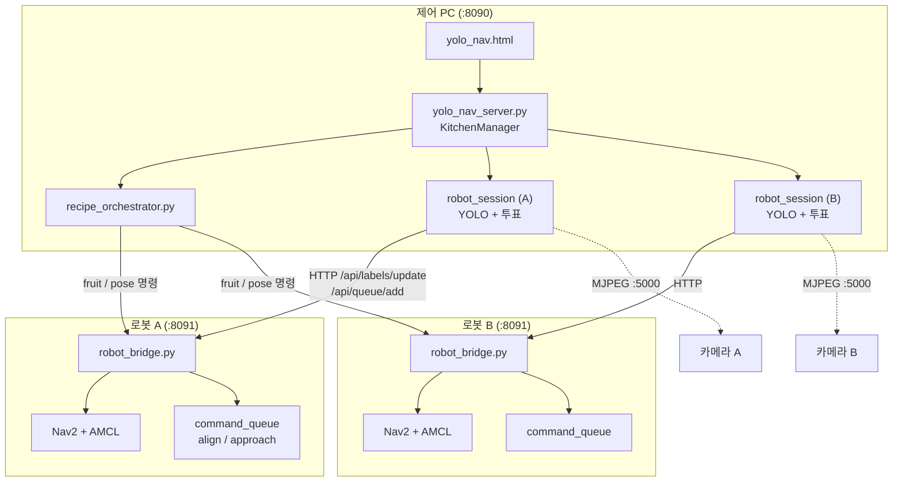
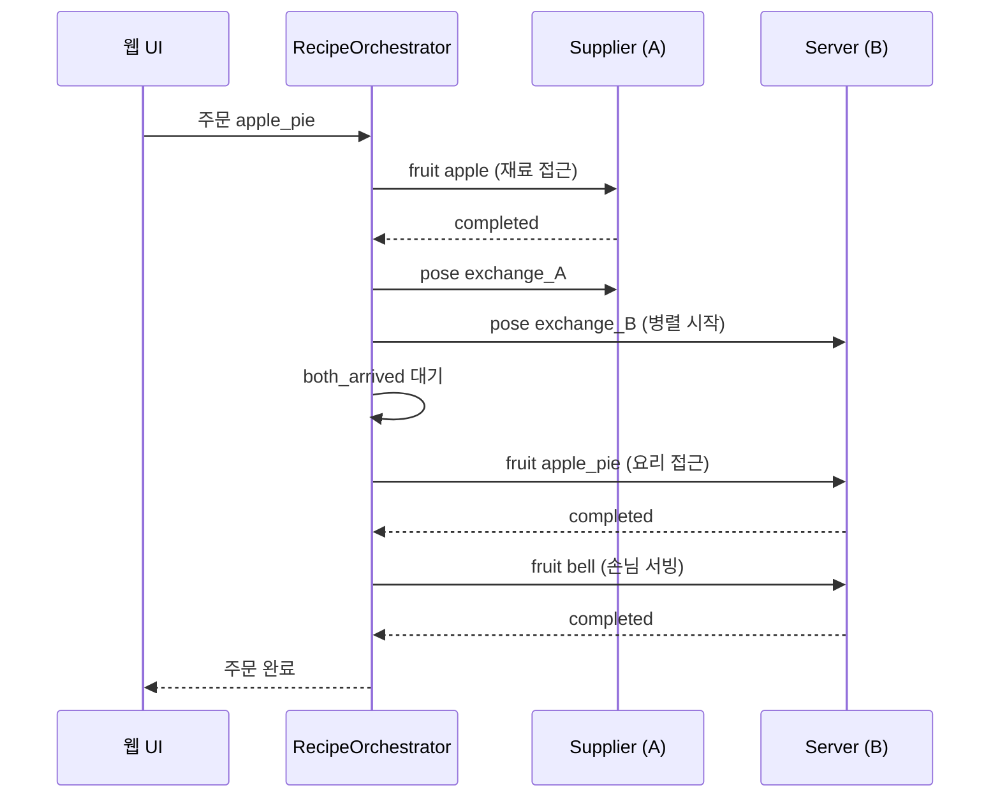

# 멀티로봇 주방 오케스트레이션 발표자료

> Pinky Pro — 2대 로봇 협업 주방 서비스  
> 문서 버전: 2026-07

---

## 1. 주제 및 서비스 설계 소개

### 1.1 발표 주제

**「서로 다른 맵에서 동작하는 2대의 모바일 로봇이, YOLO·LiDAR 융합 인식과 주문 기반 오케스트레이션으로 주방 서비스를 수행한다」**

기존 단일 로봇 과일 내비게이션(`FRUIT_NAV_QUEUE_GUIDE.md`)을 확장하여, **공급 로봇(Supplier)** 과 **서빙 로봇(Server)** 이 역할을 나눠 하나의 요리 주문을 끝까지 처리하는 시스템입니다.

### 1.2 서비스 시나리오

사용자가 웹 UI에서 요리(예: 애플파이)를 주문하면, 시스템이 레시피를 해석해 두 로봇에 순차·병렬 명령을 내립니다.

| 역할 | 로봇 | 담당 업무 |
|------|------|-----------|
| Supplier (A) | 재료 구역 맵 | 재료(apple 등) 인식·접근 → 교환장소 도착 |
| Server (B) | 서빙 구역 맵 | 교환장소 도착 → 요리(apple_pie 등) 인식·접근 → 손님(bell)에게 서빙 |

요리 4종 × 재료 4종 × 손님 1종, **총 9개 YOLO 클래스**로 주방 전체 흐름을 표현합니다.

### 1.3 설계 목표

1. **맵 분리**: 로봇 A/B는 각자 다른 맵·좌표계에서 Nav2 주행 (물리적으로 분리된 공간)
2. **중앙 오케스트레이션**: 제어 PC 1대가 주문 워크플로·YOLO·UI를 통합 관리
3. **로봇 자율 실행**: 실제 Nav2·LiDAR·미세 접근은 로봇 로컬에서 수행 (네트워크 지연 최소화)
4. **설정 기반 확장**: `kitchen_config.yaml`로 URL, 교환 좌표, 레시피, 구역 제한을 코드 수정 없이 변경

### 1.4 시스템 아키텍처



**브리지(Bridge) 방식**을 채택한 이유:

- PC는 ROS에 직접 붙지 않고 HTTP로 로봇 상태를 폴링
- YOLO 추론은 PC GPU/CPU에서 수행, 결과만 로봇 tracker에 반영
- fruit 명령·align·approach 큐는 로봇에서 tick → Nav2와 실시간 동기화

### 1.5 주문 워크플로 (애플파이 예시)



핵심 동기화 포인트는 **교환장소(handoff)** 입니다. A·B가 각자 맵의 `exchange_pose`에 도착해야 다음 단계(요리 픽업·서빙)로 진행합니다.

---

## 2. 주요 기능 소개

### 2.1 YOLO + LiDAR 클러스터 융합 라벨링

**문제**: 카메라만으로는 맵 상 절대 좌표를 알 수 없고, LiDAR만으로는 사과·바나나 등 클래스를 구분할 수 없습니다.

**해결**: 두 센서를 융합합니다.

| 단계 | 처리 |
|------|------|
| LiDAR | `/scan` → 동적 클러스터 추출 → map 좌표 등록 (`lidar_object_tracker.py`) |
| YOLO | HTTP MJPEG 영상에서 9클래스 검출 |
| 매칭 | 이미지 bearing ↔ LiDAR bearing 각도 매칭 (`yolo_nav_fusion.py`) |
| 라벨 확정 | `ClusterClassVoter` — 3초 윈도우 투표 후 클러스터에 클래스 고정, 이후 최근 인식으로 갱신 |

PC의 `robot_session.py`가 로봇 bridge 상태의 클러스터·객체 ID를 참조해 투표하고, 확정된 라벨만 `POST /api/labels/update`로 로봇에 전달합니다. 로봇은 라벨된 좌표를 기준으로 **fruit 내비게이션**을 실행합니다.

**부가 기능**

- `classify_zones`: 맵 좌표 사각형 안의 클러스터만 라벨링 (재료 구역 / 서빙 구역 분리)
- 동일 클래스 인접 클러스터 병합, 중복 검출 제거

### 2.2 명령 큐 기반 다단계 내비게이션 (Nav2 → Align → Approach)

fruit/pose 명령은 FIFO 큐(`command_queue.py`)로 순차 실행됩니다. fruit 명령은 단순 Nav2 goal이 아니라 **3단계 미세 접근**을 거칩니다.

| 단계 | 설명 |
|------|------|
| **nav2** | 라벨 좌표 앞 `approach_distance`(0.3m)까지 Nav2 이동 |
| **align** | LiDAR 방향 정렬 + LiDAR/초음파 거리로 standoff 확인 (±0.05m) |
| **approach** | 초음파 ≤ 0.10m까지 저속 전진 (`fruit_final_approach.py`) |

안정성 보강:

- align/stall 타임아웃 10s, 거리 조건 충족 시 완료 처리
- align 1회 실패 시 Nav2 goal 1회 자동 재시도
- fine approach는 `/cmd_vel_nav` publish → Nav2 velocity_smoother 경유

### 2.3 레시피 오케스트레이션 & 웹 UI

**`recipe_orchestrator.py`**

- `kitchen_config.yaml`의 레시피(요리→재료) 매핑 해석
- Supplier/Server 큐 상태 폴링, 단계별 성공/실패/타임아웃 처리
- `both_arrived` 핸드오프: 양쪽 교환 pose 완료 후에만 서빙 단계 진행

**`yolo_nav.html` (주방 모드)**

- 로봇 A/B 선택, 맵·큐·초음파·YOLO 영상 표시
- 요리 주문 버튼, 오케스트레이터 진행 상태
- 선택 로봇 대상 Initial Pose / Set Pose
- 「모든 명령 중지」— 주문 취소 + 양쪽 `stop_all`

### 2.4 (부가) 멀티로봇 HTTP 브리지 API

로봇당 `robot_bridge.py` (:8091)가 제공하는 대표 API:

| API | 역할 |
|-----|------|
| `GET /api/state` | pose, 맵, LiDAR 클러스터, 큐, 초음파 |
| `POST /api/queue/add` | fruit / pose 명령 추가 |
| `POST /api/queue/stop_all` | 실행·대기 전체 중지 |
| `POST /api/labels/update` | PC YOLO 라벨 반영 |
| `POST /api/initialpose` | AMCL 초기 위치 설정 |

---

## 3. 이슈 및 해결 과정

### 3.1 이슈 ① — 초음파 미실행으로 Approach 실패

**증상**

- 큐 메시지: `Waiting for ultrasonic, LiDAR aligning` → 20초 후 `Approach timeout`
- `/cmd_vel_nav`의 `linear.x`가 계속 0 (전진 단계 진입 불가)

**원인 분석**

```bash
ros2 topic info /us_sensor/range -v
# Publisher count: 0  ← pinky_sensor_adc 미실행
# Subscription count: 1  ← robot_bridge만 구독
```

- `bringup_robot.launch.xml`에 **초음파 ADC 노드(`pinky_sensor_adc`)가 포함되지 않음**
- `/us_sensor/range` 토픽 이름은 `topic list`에 보이지만, bridge 구독만 있어 **Publisher가 없으면 echo 무반응**
- approach 코드는 초음파가 valid(0.03~2.5m)해야만 전진 단계로 진입

**해결**

1. 로봇 실행 절차에 **터미널 4: `ros2 run pinky_sensor_adc main_node`** 추가 (5터미널 구조)
2. 가이드에 Publisher 0 vs 1 점검 방법 문서화
3. UI 초음파(m) 표시로 운영 중 센서 상태 확인 가능

**교훈**: ROS에서 토픽 **이름 존재 ≠ 데이터 publish**. `topic info -v`로 Publisher/Subscriber를 반드시 확인해야 합니다.

---

### 3.2 이슈 ② — `/cmd_vel` 다중 Publisher 경쟁으로 미세 접근 전진 실패

**증상**

- align/approach 중 로봇이 회전만 하거나 전혀 움직이지 않음
- `ros2 topic info /cmd_vel -v` → Publisher 7개 (robot_bridge, velocity_smoother, behavior_server×5)

**원인 분석**

```
robot_bridge        → /cmd_vel (10Hz, linear.x=0.06)
velocity_smoother   → /cmd_vel (20Hz, 0,0)
behavior_server     → /cmd_vel (0,0)
                              ↓
                        pinky_bringup (구독 1개, 마지막 메시지 승리)
```

- `robot_bridge`가 Nav2와 **같은 최종 토픽 `/cmd_vel`에 직접 publish**
- 더 높은 빈도의 0 명령이 전진 명령을 덮어씀

**해결**

- fine approach publish 대상을 **`/cmd_vel_nav`** 로 변경
- 경로: `robot_bridge → /cmd_vel_nav → velocity_smoother → /cmd_vel → 모터`
- Nav2 goal cancel 후 controller idle 상태에서 bridge 명령이 smoother를 거쳐 전달

**교훈**: ROS2에서 동일 토픽에 복수 Publisher가 있으면 **의도하지 않은 명령 경쟁**이 발생합니다. 미세 제어는 Nav2 파이프라인 **입력 단계**에 합류시키는 것이 안전합니다.

---

### 3.3 이슈 ③ — 클러스터 클래스가 최근 인식으로 고정되지 않음

**증상**

- YOLO 영상에서는 클래스가 바뀌었으나 맵 클러스터 라벨은 이전 클래스 유지 또는 unknown
- 주방 모드에서 fruit 명령이 잘못된 객체를 향함

**원인 분석**

1. **잠긴(locked) 객체**의 map 좌표가 클러스터 이동 후 갱신되지 않아 라벨-클러스터 연결 끊김
2. 투표 시 **누적 점수**가 높은 예전 클래스가 최근 인식보다 우선
3. 주방 모드 `robot_session`이 프레임마다 즉시 push만 하고 **투표·확정 로직 없음**
4. 인접 객체 클래스 충돌 시 `update_object_class` 실패

**해결**

| 모듈 | 조치 |
|------|------|
| `lidar_object_tracker.py` | locked 객체도 클러스터 위치 추적, 충돌 시 stale 객체 제거 |
| `cluster_class_voter.py` | 라벨 확정 후 **가장 최근 투표**로 클래스 갱신 |
| `robot_session.py` | `ClusterClassVoter` 도입, 확정 시에만 bridge로 push |

---

### 3.4 이슈 ④ — 주방 모드 Pose API·코드 동기화

**증상**

- UI Set Pose는 성공, Initial Pose는 HTTP 405
- PC만 코드 갱신 시 로봇 approach 동작 변화 없음

**해결**

- PC `yolo_nav_server.py`에 `/api/robots/<id>/initialpose` 추가
- UI에서 선택 로봇 bridge로 pose API 라우팅
- fruit 큐·align·approach는 **로봇 `robot_bridge`에서 실행** → PC/로봇 파일 동기화 절차 문서화 (`KITCHEN_MULTI_ROBOT_GUIDE.md` §6.1)

---

## 4. 느낀점

### 4.1 로봇과 PC 간 통신·설정의 중요성

멀티로봇 주방 서비스는 **한 대의 로봇이 아니라 PC·로봇 A·로봇 B가 네트워크로 묶인 분산 시스템**입니다. 알고리즘보다 먼저 «연결이 맞는지»가 서비스 성패를 가릅니다.

**설정이 어긋나면 바로 드러나는 항목**

| 구분 | 설정 예 | 문제가 생기면 |
|------|---------|----------------|
| 네트워크 | `kitchen_config.yaml`의 `bridge_url`, `stream_url` | UI·오케스트레이터가 로봇에 명령을 못 보냄 |
| HTTP 브리지 | 로봇 `:8091` `robot_bridge.py` 실행 | state 폴링 실패, 라벨·큐 API 무반응 |
| 영상 스트림 | 로봇 `:5000` MJPEG | PC YOLO 루프 중단 → 라벨링 전체 정지 |
| ROS 도메인 | PC·로봇 `ROS_DOMAIN_ID` 일치 (단일 모드) | LiDAR·맵 토픽 미수신 |
| 코드 동기화 | PC/로봇 동일 버전의 `command_queue.py` 등 | PC만 수정해도 approach·align 동작 불변 |
| 센서 파이프라인 | `pinky_sensor_adc` 실행 여부 | 토픽 이름은 있는데 Publisher 0 → approach 실패 |

실제 트러블슈팅에서도 **Initial Pose 405**(PC API 미갱신), **Publisher 0**(센서 미실행), **`/cmd_vel` 경쟁**(토픽 경로 불일치)처럼, «코드 버그»처럼 보였던 문제 상당수가 **실행 위치·URL·토픽·프로세스 동기화** 문제였습니다.

**느낀 점**

- 분산 로봇 프로젝트에서는 **IP·포트·실행 순서·파일 버전**을 기능과 동등한 수준으로 관리해야 합니다.
- `ros2 topic info -v`, `curl /api/state`, bridge Publisher 확인 같은 **연결 점검 루틴**이 없으면 원인 파악에 시간이 크게 늘어납니다.
- `KITCHEN_MULTI_ROBOT_GUIDE.md`에 5터미널 절차·동기화 체크리스트를 남긴 것은, 통신·설정이 곧 서비스 품질이라는 경험을 반영한 것입니다.

### 4.2 YOLO 객체 인식 모델 훈련의 중요성

이 프로젝트에서 **맵上的 목표 좌표와 fruit 명령의 시작점**은 Nav2가 아니라 YOLO입니다. LiDAR는 «어디에 무언가 있다»를 알려주고, **«그것이 사과인지 애플파이인지»**는 전적으로 학습 모델 품질에 달려 있습니다.

**모델이 서비스 전체에 미치는 영향**

| YOLO 품질 | downstream 영향 |
|-----------|-----------------|
| 클래스 혼동 (apple ↔ apple_pie) | Supplier/Server가 잘못된 fruit 명령 실행 |
| 검출 누락·저신뢰 | `ClusterClassVoter` 미통과 → 클러스터 unknown 유지 |
| 박스 위치·크기 부정확 | LiDAR bearing 매칭 실패 → 융합 좌표 오류 |
| 환경 미반영 (조명·각도) | 주방 현장에서 라벨 불안정 → approach 타겟 흔들림 |
| 클래스 수 증가 (9클래스) | 재료·요리·손님 구분 난이도 상승, 데이터 불균형에 취약 |

9클래스(`apple`, `banana`, `carrot`, `jelly`, `apple_pie`, `carrot_soup`, `banana_pudding`, `orange`, `bell`)는 단순 과일 4종 내비보다 **역할별 시맨틱이 달라** 레시피 오케스트레이션과 직결됩니다. 모델이 `jelly`를 `orange` 요리로 안정적으로 내주지 못하면, 설정 파일의 레시피 매핑이 아무리 정확해도 주문이 실패합니다.

**느낀 점**

- **센서 융합·명령 큐·오케스트레이션은 YOLO 위에 쌓인 구조**이므로, 현장 데이터로 `best.pt`를 충분히 학습·검증하지 않으면 이후 단계를 아무리 다듬어도 체감 성능이 오르지 않습니다.
- `label_confidence`, `classify_zones`, 투표 윈도우 등은 **잘못된 검출을 걸러내는 보조 장치**일 뿐, 근본적인 클래스 구분력을 대체하지 못합니다.
- 향후에는 **로봇별 카메라 시야·조명·배치에 맞춘 재학습**, 클래스별 샘플 수 균형, 요리/재료가 비슷하게 생긴 경우의 hard negative 수집이 서비스 안정화의 핵심 과제라고 느꼈습니다.

---

## 부록: 기술 스택 요약

| 구분 | 기술 |
|------|------|
| 로봇 플랫폼 | Pinky (Raspberry Pi, LiDAR, 초음파, 카메라) |
| 미들웨어 | ROS 2 Jazzy, Nav2, AMCL |
| 인식 | YOLO (Ultralytics), 9클래스 custom model |
| 제어 PC | Flask (`yolo_nav_server.py`), HTTP 브리지 |
| 설정 | `kitchen_config.yaml` |
| UI | `yolo_nav.html` (웹, :8090) |

**관련 문서**

- 운영 가이드: `KITCHEN_MULTI_ROBOT_GUIDE.md`
- 단일 로봇 기반: `FRUIT_NAV_QUEUE_GUIDE.md`

---

*발표 시 권장 데모 순서: (1) 로봇 A/B 맵·라벨 표시 → (2) YOLO 라벨링 실시간 확인 → (3) 애플파이 주문 → (4) 오케스트레이터 단계·큐 메시지 관찰 → (5) 서빙 완료*
